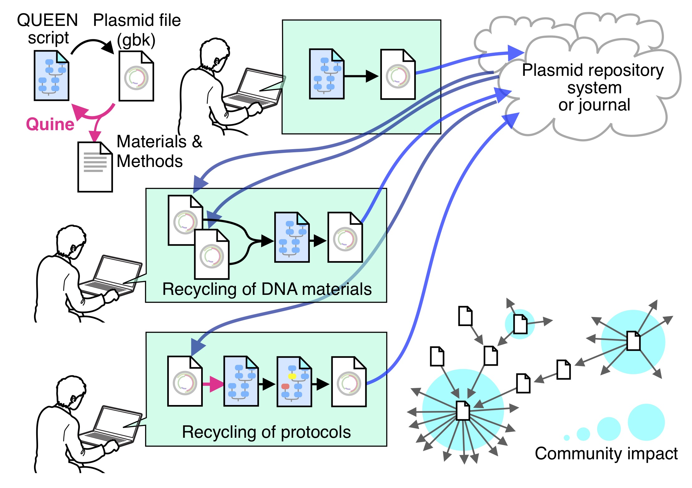

# QUEEN Installation and User Manual

QUEEN (a framework to generate quinable and efficiently editable nucleotide sequence resources) is a Python programming module designed to describe, share credit DNA building processes and resources. DNA parts information can be imported from external annotated DNA files (GenBank and FASTA format). Output file (GenBank format) encodes the complete information of the constructed DNA and its annotations and enables the production of a quine code that self-reproduces the output file itself. In QUEEN, all of the manipulations required in DNA construction are covered by four simple operational functions, "cutdna", "modifyends", "flipdna", and "joindna" that can collectively represent any of the standard molecular DNA cloning processes, two search functions, "searchsequence" and "searchfeature", and two super functions, "editsequence" and "editfeature".  A new DNA can be designed by programming a Python script or using Jupyter Notebook, an interactive Python programming interpreter. The designed DNA product can be output in the GenBank file format that involves the history of its building process. The "quinable" feature of a QUEEN-generated GenBank file certifies that the annotated DNA material information and its production process are fully transparent, reproducible, inheritable, and modifiable by the community.



If you've found QUEEN is useful for your research, please consider citing our paper published in Nature Communications.  

Mori, H., Yachie, N. A framework to efficiently describe and share reproducible DNA materials and construction protocols. Nat Commun 13, 2894 (2022). https://doi.org/10.1038/s41467-022-30588-x

- [Software dependency](#Software-dependency)
- [Installation](#Installation)
- [Usage](#Usage)
- [QUEEN class](#QUEEN-class)
- [Output functions](#Output-functions)
  - [.printsequence()](https://github.com/yachielab/QUEEN#printsequencestartint-endint--strandint-displaybool-hide_middleint-linebreakint)
  - [.printfeature()](https://github.com/yachielab/QUEEN#printfeaturefeature_listlist-attributelist-seqbool-separationstr-outputstr-x_based_indexint)
  - [.outputgbk()](https://github.com/yachielab/QUEEN#outputgbkoutputstr)
- [Search Function](#Search-Function)
  - [.searchsequence()](https://github.com/yachielab/QUEEN#searchsequence-queryregex-or-str-startint-endint-strandint-productstr-process_namestr-process_descriptionstr)
  - [.searchfeature()](https://github.com/yachielab/QUEEN#searchfeaturekey_attributestr-queryregex-or-str-sourcelist-of-dnafeature_objects-startint-endint-strandint-productstr-process_namestr-process_descriptionstr)
- [Operational functions](#Operational-functions)
  - [cutdna()](https://github.com/yachielab/QUEEN#cutdnainputqueen_object-cutsiteslist-of-int-intint-or--dnafeature_object-productstr-process_namestr-process_descriptionstr)
    - [cropdna()](https://github.com/yachielab/QUEEN#cropdnainputqueen_object-startint-intint-or--dnafeature_object-endint-intint-or--dnafeature_object-productstr-process_namestr-process_descriptionstr)
  - [modifyends()](https://github.com/yachielab/QUEEN#modifyendsinputqueen_object-leftstrstr-rightstrstr-productstr-process_namestr-process_descriptionstr)
  - [flipdna()](https://github.com/yachielab/QUEEN#flipdnainputqueen_object-productstr-process_namestr-process_descriptionstr)
  - [joindna()](https://github.com/yachielab/QUEEN#joindnainputslist-of-queen-objects-topologystr-stickyend_lengthint-productstr-process_namestr-process_descriptionstr)
  - [editsequence()](https://github.com/yachielab/QUEEN#editsequenceinputqueen-object-source_sequenceregex-or-str-destination_sequencestr-startint-endint-strandint-productstr-process_namestr-process_descriptionstr)
  - [editfeature()](https://github.com/yachielab/QUEEN#editfeatureinputqueen_object-key_attributestr-queryregex-or-str-sourcelist-of-dnafeature_objects-startint-endint-strandint-target_attributestr-operationfunction-new_copybool-productstr-process_namestr-process_descriptionstr)
- [Common parameters of the quinable functions](#Common-parameters-of-the-quinable-functions)
- [Quine](#Quine)
  - [quine()](https://github.com/yachielab/QUEEN#quine-inputqueen_object-outputstr-process_descriptionbool-executionbool)
- [Visualization](#Visualization)
  - [visualizemap()](https://github.com/yachielab/QUEEN#visualizemapinputqueen_object-map_viewstr-feature_listlist-startint-endint-width_scalefloat-height_scalefloat-label_locationstr-linebreakint-seqbool-diameterfloat)
  - [visualizeflow()](https://github.com/yachielab/QUEEN#visualizeflowinputlist-of-queen_objects-search_functionbool-groupingbool-process_classificationbool-intermediate_productbool)

## News

***qexperiment module was added***

qexperiment module enable users to easily describe and simulate experimental molecular cloing process with newly implemented methods based on actual experimental methods. For now, the following methods can be available.

- pcr
- digestion
- ligation
- homology_based_assembly
- annealing
- gateway_reaction
- goldengate_assembly
- primerdesigin (prototype)

For deatails, please see [qexperiment_usage.md](https://github.com/yachielab/QUEEN/blob/master/qexperiment_usage.md), [qexperiment_demo.ipynb](https://github.com/yachielab/QUEEN/blob/master/demo/qexperiment/qexperiment_demo.ipynb) and [Google colab notebook](https://colab.research.google.com/drive/1gzwVUcO3YYqf3Ypqq6TT7OZttDYs1U4D?usp=sharing).

## Change log

Please see [changelog.md](https://github.com/yachielab/QUEEN/blob/master/changelog.md).

## Software dependency

Python 3.7.0 or later

## Installation

1. Install QUEEN using the following command.  
    For the official release (v1.1.0) on the Python Package Index  
   
   ```
   pip install python-queen 
   ```
   
    For the developmental version on GitHub  
   
   ```
   pip install git+https://github.com/yachielab/QUEEN.git@(branch name) 
   ```

2. Install Graphviz (optional; required for visualizing flowcharts of DNA building processes using the `visualizeflow()` function described below). Graphviz package is available at the following link.  
   
   - [Graphviz](https://graphviz.org/download/source/)

## Usage

QUEEN provides the QUEEN class to define a double-stranded (ds)DNA object with sequence annotations. The QUEEN class and its operational functions are described below. Jupyter Notebook files for all of the example codes are provided in `./demo/tutorial` of QUEEN ([https://github.com/yachielab/QUEEN](https://github.com/yachielab/QUEEN)) and made executable in Google Colaboratory. 

- [tutorial_ex01-23](https://colab.research.google.com/drive/1ubN0O8SKXUr2t0pecu3I6Co8ctjTp0PS?usp=sharing)
- [tutorial_ex24-28](https://colab.research.google.com/drive/1dPcNhsOl2sne_wq7ZULXXFUxizR6JQrR?usp=sharing)

**Command line interface**  
A part of QUEEN functions can also be used from the command line interface (CLI) instead of describing python codes.  
For details, please see [CLI_usage.md](https://github.com/yachielab/QUEEN/blob/master/CLI_usage.md) 

**Simulators for general molecular cloning methods**  
simple molecular cloning simulators for both homology-based and digestion/ligation-based assembly are provided on Google colab. By using these simulators, you can exeperience the benefits of QUEEN without describing python codes. 

- [Digestion/ligation-based assembly simulator](https://colab.research.google.com/drive/1N8PGOqGobO8Wg5b78oy1E8BKMBJJl6cx?usp=sharing)
- [Homology-based assembly simulator](https://colab.research.google.com/drive/1zpwN0lDEHhHTjiibrM4UtB2XTCuw4nZ0?usp=sharing)

## QUEEN class

The QUEEN class can define a dsDNA object with sequence annotations. It can be created by specifying a DNA sequence or importing a sequence data file in GenBank or FASTA file format (single sequence entry). When a GenBank format file is imported, its NCBI accession number, Addgene plasmid ID, or Benchling share link can be provided instead of downloading the file to your local environment.

#### Example code 1: Create a QUEEN class object (blunt-ends)

A `QUEEN_object` (blunt-end) is created by providing its top-stranded sequence (5’-to-3’). By default, the DNA topology will be linear.  
(Expected runtime: less than 1 sec.)  

**Source code**

```python
from QUEEN.queen import *
dna = QUEEN(seq="CCGGTATGCGTCGA") 
```

#### Example code 2: Create a QUEEN class object (sticky-end)

The left and right values separated by `"/"` show the top and bottom strand sequences of the generating `QUEEN_object`, respectively. The top strand sequence is provided in the 5’-to-3’ direction from left to right, whereas the bottom strand sequence is provided in the 3′-to-5′ direction from left to right. Single-stranded regions can be provided by `"-"` for the corresponding nucleotide positions on the opposite strands. A:T and G:C base-pairing rule is required between the two strings except for the single-stranded positions.  
(Expected runtime: less than 1 sec.)  

**Source code**

```python
from QUEEN.queen import *
dna = QUEEN(seq="CCGGTATGCG----/----ATACGCAGCT") 
```

#### Example code 3.1: Create a circular QUEEN class object

The sequence topology of generating `QUEEN_object` can be specified by `"linear"` or` "circular"`.  
(Expected runtime: less than 1 sec.) 

**Source code**

```python
from QUEEN.queen import *
dna = QUEEN(seq="CCGGTATGCGTCGA", topology="circular") 
```

#### Example code 3.2: Create a ssDNA QUEEN class object \*(available from v1.1)

The single strand `QUEEN_object` can be generated by specifying `ssdna=True`.  
(Expected runtime: less than 1 sec.) 

**Source code**

```python
from QUEEN.queen import *
dna = QUEEN(seq="CCGGTATGCGTCGA", ssdna=True) 
```

#### Example code 4.1: Create a QUEEN class object from a GenBank file in a local directory

GenBank file can be loaded by specifying its local file path.  
(Expected runtime: less than 1 sec.)  

**Source code**

```python
from QUEEN.queen import *
pUC19 = QUEEN(record="./input/pUC19.gbk")
```

#### Example code 4.2: Create a QUEEN class object using a NCBI accession number

QUEEN_object can be generated from a NCBI accession number with `dbtype="ncbi"`.  
(Expected runtime: less than 1 sec.)  

**Source code**

```python
from QUEEN.queen import *
#"M77789.2" is NCBI accession number for pUC19 plasmid
pUC19 = QUEEN(record="M77789.2", dbtype="ncbi") 
```

#### Example code 4.3: Create a QUEEN class object using an Addgene plasmid ID

`QUEEN_object` can be generated from an Addgene plasmid ID with `dbtype="addgene"`.  
(Expected runtime: less than 1 sec.)  

**Source code**

```python
from QUEEN.queen import *
#"50005" is Addgene plasmid ID for pUC19 plasmid
pUC19 = QUEEN(record="50005", dbtype="addgene")
```

#### Example code 4.4: Create a QUEEN class object from a Benchling share link

`QUEEN_object` can be generated from a Benchling shared link with `dbtype="benchling"`.  
(Expected runtime: less than 1 sec.)  

**Source code**

```python
from QUEEN.queen import *
plasmid = QUEEN(record="https://benchling.com/s/seq-U4pePb09KHutQzjyOPQV", dbtype="benchling")
```

pX330 plasmid encoding a Cas9 gene and a gRNA expression unit is provided in the above example. The `QUEEN_object` generated here is used in the following example codes in this document.

### Properties of QUEEN class objects

* **.project**: `str`  
  Project name of `QUEEN_object` construction. In QUEEN, this property is also used as a dictionary key to access the `.productdict` described below. If a `QUEEN_object` is created from a GenBank or FASTA file, its sequence ID will be inherited here. Otherwise, the project name is automatically generated to be unique amongst the existing `.productdict` keys.

* **.seq**: `str`  
  Top strand sequence (5′→3′). This property cannot be directly edited; only the built-in operational functions of QUEEN described below can edit this property.

* **.rcseq**: `str`  
  Bottom strand sequence (5′→3′). This property cannot be directly edited; only the built-in operational functions of QUEEN described below can edit this property.

* **.topology**: `str` (`"linear"` or `"circular"`)   
  Sequence topology. When a `QUEEN_object` is created by loading from a GenBank file, the topology is set according to the description in the GenBank file. Only the built-in operational functions of QUEEN described below can edit this property.

* **.dnafeatures**: `list` of `DNAfeature_objects`  
  When a `QUEEN_object` is loaded from a GenBank file, `.dnafeatures` will automatically be generated from the GenBank file's sequence features. Otherwise, `.dnafeatures` will be an empty list. Each `DNAfeature_object` with the following attributes provides an annotation for a given range of DNA sequence in a `QUEEN_object`.
  
  * **.feature_id**: `str`    
    Unique identifier. It is automatically determined to each feature when a `QUEEN_object` is loaded from a GenBank file.
  * **.feature_type**: `str`    
    Biological nature. Any value is acceptable. The GenBank format requires registering a biological nature for each feature.
  * **.start**: `int`  
    Start position of `DNAfeature_object` in `QUEEN_object`.
  * **.end**: `int`  
    End position of `DNAfeature_object` in `QUEEN_object`.
  * **.strand**: `int (1 or -1)`  
    Direction of `DNAfeature_object` in `QUEEN_object`. Top strand (`1`) or bottom strand (`-1`).  
  * **.sequence**: `str`  
    Sequence of the `DNAfeature_object` for its encoded direction.
  * **.qualifiers**: `dict`  
    Qualifiers. When a GenBank file is imported, qualifiers of each feature will be registered here. Qualifier names and values will serve as dictionary keys and values, respectively. 
  
  `DNAfeature_object` can be edited only by the `editfeature()` function described below. DNAfeature class is implemented as a subclass of the Biopython SeqFeature class. Therefore, apart from the above attributes, DNAfeature class inherits all the attributes and methods of SeqFeature class. For details about SeqFeature class, see (https://biopython.org/docs/dev/api/Bio.SeqFeature.html) 

* **.productdict**: `dict`  
  Dictionary for all of the inherited `QUEEN_objects` used to construct the present `QUEEN_object`. The `.project` of each `QUEEN_object` serves as a key of this dictionary.

* **.record**: `Bio.SeqRecord`  
  Bio.SeqRecord object that was used as the source for creating the QUEEN object.

## Output functions

`QUEEN_objects` hold a simple set of functions to output its information.

* ##### **`.printsequence(start=int, end=int, strand=int, display=bool, hide_middle=int, linebreak=int)`**
  
  Returns and displays partial or the entire dsDNA sequence and sequence end structures of `QUEEN_object`.
  
  #### Parameters
  
  * **start**: `int` (zero-based indexing; default: `0`)  
    Start position of the sequence. 
  * **end**: `int` (zero-based indexing; default: the last sequence position of `QUEEN_object`)  
    End position of the sequence.
  * **strand**: `int`: `1` (top strand only), `-1` (bottom strand only), or `2` (both strands) (default: `2`)  
    Sequence strand(s) to be returned.
  * **display**: `bool` (`True` or `False`; default: `False`)   
    If `True`, the output will be displayed in `STDOUT`.
  * **hide_middle**: `int` or `None` (default: `None`)  
    Length of both end sequences to be displayed.
  * **linebreak**: `int` (default: length of the `QUEEN_object` sequence)  
    Length of sequence for linebreak.
  
  #### Return
  
  > If `strand` is `1` or `-1`, sequence of the defined strand (5’→3’)  
  > If `strand` is `2`, `"str/str"`: "top strand sequence (5’→3’)/bottom strand sequence (3’→5’)"  

#### Example code 5: Print a dsDNA object

  (Expected runtime: less than 1 sec.)  

  **Source code**

```python
from queen import *
fragment = QUEEN(seq="CCGGTATGCG----/----ATACGCAGCT") 
fragment.printsequence(display=True)
```

  **Output**

```
5′ CCGGTATGCG---- 3′
3′ ----ATACGCAGCT 5′
```

* ##### **`.printfeature(feature_list=list, attribute=list, seq=bool, separation=str, output=str, x_based_index=int)`**
  
    Print a tidy data table of annotation features/attributes of `QUEEN_object`. Default output attributes are `"feature_id"`, `"feature_type"`, `"qualifier:label"`, `"start"`, `"end"`, and `"strand"`.
  
  #### Parameters
  
  * **feature_list**: `list` of `DNAfeaure_objects` (default: `.dnafeatures`)  
    List of features to be displayed in the output table. If not given, all features held by the QUEEN_object will be the subject.
  
  * **attribute**: `list` of feature attributes (default: `["feature_id", "feature_type", "qualifier:label", "start", "end", "strand"]`)   List of feature attributes to be displayed in the output table. If the value is `"all"`, it will generate a table for all the attributes held by the `QUEEN_object` except for `"sequence"`.
  
  * **seq**: `bool` (`True` or `False`; default: `False`)  
    If `True`, the sequence of each feature for its encoded direction will be displayed in the output table.   
  
  * **separation**: `str` (default: space(s) to generate a well-formatted table)  
    String to separate values of each line.
  
  * **output**: `str` (default: `STDOUT`)  
    Output file name. 
  
  * **x_based_index**: `0` or `1` (default: `0`)  
    As a default, positions of all features are given in the zero-based indexing in QUEEN (same as Python). If this parameter is set to `1`, they will be shown in the 1-based indexing (as seen in the GenBank format).
    
    #### Return
    
    > `None`
    
    #### Example code 6: Print DNA features in a well-formatted table
    
    (Expected runtime: less than 1 sec.)  
    
    **Source code**
    
    ```python
    from QUEEN.queen import *
    plasmid = QUEEN(record="input/px330.gb") 
    plasmid.printfeature()
    ```
    
    **Output**
    
    ```
    feature_id  feature_type   qualifier:label     start  end   strand  
    1           source         source              0      8484  +       
    100         primer_bind    hU6-F               0      21    +       
    200         promoter       U6 promoter         0      241   +       
    300         primer_bind    LKO.1 5'            171    191   +       
    400         misc_RNA       gRNA scaffold       267    343   +       
    500         enhancer       CMV enhancer        439    725   +       
    600         intron         hybrid intron       983    1211  +       
    700         regulatory     Kozak sequence      1222   1232  +       
    800         CDS            3xFLAG              1231   1297  +       
    900         CDS            SV40 NLS            1303   1324  +       
    1000        CDS            Cas9                1348   5449  +       
    1100        CDS            nucleoplasmin NLS   5449   5497  +       
    1200        primer_bind    BGH-rev             5524   5542  -       
    1300        polyA_signal   bGH poly(A) signal  5530   5738  +       
    1400        repeat_region  AAV2 ITR            5746   5876  +       
    1500        repeat_region  AAV2 ITR            5746   5887  +       
    1600        rep_origin     f1 ori              5961   6417  +       
    1700        primer_bind    F1ori-R             6048   6068  -       
    1800        primer_bind    F1ori-F             6258   6280  +       
    1900        primer_bind    pRS-marker          6433   6453  -       
    2000        primer_bind    pGEX 3'             6552   6575  +       
    2100        primer_bind    pBRforEco           6612   6631  -       
    2200        promoter       AmpR promoter       6698   6803  +       
    2300        CDS            AmpR                6803   7664  +       
    2400        primer_bind    Amp-R               7021   7041  -       
    2500        rep_origin     ori                 7834   8423  +       
    2600        primer_bind    pBR322ori-F         8323   8343  +     
    ```

* ##### **`.outputgbk(output=str, format=str, record_id=str, annotation=dict, export_history=True)`**
  
    Output `QUEEN_object` to a GenBank file. In addition to all of the `DNAfeature_objects` in the input `QUEEN_object`, a `DNAfeature_object` encoding the entire construction processes that generated the `QUEEN_object` in `qualifiers:building_history` will also be output to the GenBank file.  
  
  ##### Parameter
  
  * **output**: `str` (default: `STDOUT`)  
      Output file name.  
  
  * **format**: `str` (default: `"genbank"`)  
    Output file format ("genbank" or "fasta")  
  
  * **annotation**: `str` (default: `None`)  
      Dictionary of annotations for the genbank.  
    For details, please see https://biopython.org/docs/latest/api/Bio.SeqRecord.html.
  
  * **export_history**: `bool` (default: `True`)  
      If False, construnction history of the `QUEEN_object` will not be output.
    
    ##### Return
    
    > `None`

## Search Function

`QUEEN_objects` hold `.searchsequene()` and `.searchfeature()` functions that enables users to search for query sequences and values in `DNAfeature_objects`.

* ##### **`.searchsequence (query=regex or str, start=int, end=int, strand=int, product=str, process_name=str, process_description="str")`**
  
  Search for specific sequences from a user-defined region of a `QUEEN_object` and return a list of `DNAfeature_objects`. Start and end attributes of returned `DNAfeature_objects` represent the sequence regions of the `QUEEN_object` that matched the user's query. Note that the returned `DNAfeature_objects` will not be generated with `.feature_id` and reflected to the parental `QUEEN_object`**. **The returned `DNAfeature_objects` can be added to `QUEEN_object.dnafeatures` by `editfeature()` with the `createattribute` option as explained below.
  
  #### Parameters
  
  * **query**: `regex` or `str` (default: `".+"`)  
    Search query sequence. If the value is not provided, the user-specified search region of the `QUEEN_object` sequence with `start` and `end` explained below will be returned. It allows fuzzy matching and regular expression. For details, see [https://pypi.org/project/regex/](https://pypi.org/project/regex/). All IUPAC nucleotide symbols can be used. Restriction enzyme cut motif representation can be used to define a query with `"^"` and `"_"` or `"(int/int)"`. For example, EcoRI cut motif can be provided by `"G^AATT_C"`, where `"^"` and `"_"` represent the cut positions on the top and bottom strands, respectively, or by `"GAATTC(-5/-1)"` or `"(-5/-1)GAATTC"`, where the left and right integers between the parentheses represent the cut positions on the top and bottom strands, respectively. Similarly, the cut motif of a Type-IIS restriction enzyme BsaI can be given by `"GGTCTCN^NNN_N"`,  `"N^NNN_NGAGACC"`, `"GGTCTC(1/5)"` or `"(5/1)GAGACC"`. The returned `DNAfeature_objects` obtained for a query restriction enzyme cut motif will hold the cutting rule in the `qualifier:cutsite"` attribute, which can be added to `QUEEN_object.dnafeatures` by `editfeature()` with the `createattribute` option as explained below. Regular expression is disabled for restriction enzyme cut motifs.  
  * **start**: `int` (zero-based indexing; default: `0`)  
    Start position of the target range of the `QUEEN_object` sequence for the search. 
  * **end**: `int` (zero-based indexing; default: the last sequence position of `QUEEN_object`)  
    End position of the target range of the `QUEEN_object` sequence for the search. 
  * **strand**: `int`: `1` (top strand only), `-1` (bottom strand only), or `2` (both strands) (default: `2`)  
    Sequence strand to be searched.
  * **unique**: `bootl`: `True` or `False` (default: False)
    If the value is `True` and multiple (more than a single) sequence region are detected in the search, it would raise error.
    If False, multiple seaquence detections could be acceptable.  
  
  #### Return
  
  > `list` (`list` of `DNAfeature_objects`)
  
  #### Example code 7: Search for a DNA sequence motif with regular expression
  
  (Expected runtime: less than 1 sec.) 
  
  **Source code (continued from the previous code)**
  
  ```python
  match_list = plasmid.searchsequence(query="G[ATGC]{19}GGG")
  plasmid.printfeature(match_list, seq=True, attribute=["start", "end", "strand"])
  ```
  
  **Output**
  
  ```
  start  end   strand  sequence                 
  115    138   +       GTAGAAAGTAATAATTTCTTGGG  
  523    546   +       GACTTTCCATTGACGTCAATGGG  
  816    839   +       GTGCAGCGATGGGGGCGGGGGGG  
  1372   1395  +       GACATCGGCACCAACTCTGTGGG  
  1818   1841  +       GGCCCACATGATCAAGTTCCGGG  
  3097   3120  +       GATCGGTTCAACGCCTCCCTGGG  
  3300   3323  +       GCGGCGGAGATACACCGGCTGGG  
  3336   3359  +       GAAGCTGATCAACGGCATCCGGG  
  3529   3552  +       GGCAGCCCCGCCATTAAGAAGGG  
  3577   3600  +       GACGAGCTCGTGAAAGTGATGGG  
  ︙
  493    516   -       GCGTTACTATTGACGTCAATGGG  
  654    677   -       GTCCCATAAGGTCATGTACTGGG  
  758    781   -       GGTGGGGAGGGGGGGGAGATGGG  
  1014   1037  -       GCGCGAGGCGGCGGCGGAGCGGG  
  1301   1324  -       GACCTTCCGCTTCTTCTTTGGGG  
  1820   1843  -       GCCCCGGAACTTGATCATGTGGG  
  2090   2113  -       GAAGTTGCTCTTGAAGTTGGGGG  
  2183   2206  -       GGCGTACTGGTCGCCGATCTGGG  
  2288   2311  -       GATCATAGAGGCGCTCAGGGGGG  
  2689   2712  -       GCCAGAGGGCCCACGTAGTAGGG  
  ︙
  ```

#### Example code 8: Search for a DNA sequence motif with fuzzy matching

  Search for `"AAAAAAAA"` sequence, permitting a single nucleotide mismatch.  
  (Expected runtime: less than 1 sec.) 

  **Source code (continued from the previous code)**

```python
match_list = plasmid.searchsequence(query="(?:AAAAAAAA){s<=1}")
plasmid.printfeature(match_list, seq=True) 
```

  **Output**

```
feature_id  feature_type  qualifiers:label  start  end   strand  sequence  
null        misc_feature  null              5484   5492  +       AAAAAAGA  
null        misc_feature  null              6369   6377  +       AACAAAAA  
null        misc_feature  null              7872   7880  +       AAACAAAA  
null        misc_feature  null              346    354   -       AAAACAAA  
null        misc_feature  null              799    807   -       AAAAAATA  
null        misc_feature  null              1201   1209  -       GAAAAAAA  
null        misc_feature  null              6716   6724  -       AAAAATAA  
null        misc_feature  null              7844   7852  -       AGAAAAAA 
```

#### Example code 9: Search for a DNA sequence with the IUPAC nucleotide code

  (Expected runtime: less than 1 sec.) 

  **Source code (continued from the previous code)**

```python
match_list = plasmid.searchsequence(query="SWSWSWDSDSBHBRHH")
plasmid.printfeature(match_list, seq=True)
```

  **Output**

```
feature_id  feature_type  qualifiers:label  start  end   strand  sequence          
null        misc_feature  null              4098   4114  +       GAGACAGCTGGTGGAA  
null        misc_feature  null              3550   3566  -       CTGTCTGCAGGATGCC  
null        misc_feature  null              5239   5255  -       CTCTGATGGGCTTATC  
null        misc_feature  null              6415   6431  -       GAGAGTGCACCATAAA  
null        misc_feature  null              8357   8373  -       GTCAGAGGTGGCGAAA  
```

* ##### **`.searchfeature(key_attribute=str, query=regex or str, source=list of DNAfeature_objects, start=int, end=int, strand=int)`**
  
  Search for `DNAfeature_objects` holding a queried value in a designated `key_attribute` in `QUEEN_object`.
  
  #### Parameters
  
  * **key_attribute**: `str` (default: `"all"`)  
    Attribute type to be searched (`feature_id`, `feature_type`, `"qualifier:*"`, or `sequence`). If the value is not provided, it will be applied to all of the attributes in the `QUEEN_object`, excluding `sequence`. However, if the `query` value is provided with only the four nucleotide letters (A, T, G, and C), this value will be automatically set to `sequence`.
  
  * **query**: `regex` or `str`(default: `".+"`)  
    Query term. `DNAfeature_objects` that have a value matches to this query for `key_attribute` designated above will be returned. It allows fuzzy matching and regular expression. For details, see [https://pypi.org/project/regex/](https://pypi.org/project/regex/). If the `key_attribute` is `sequence`, all IUPAC nucleotide symbols can be used.
  
  * **source**: `list` of_ `DNAfeature_objects` (default: `QUEEN_object.dnafeatures`)  
    Source `DNAfeature_objects` to be searched. `DNAfeature_objects` outside the search range defined by `start`, `end`, and `strand` will be removed from the source. Any `DNAfeature_objects` can be provided here. For example, a list of `DNAfeature_objects` _returned from another `searchsequence()` or `searchfeature()` operation can be used as the source to achieve an AND search with multiple queries.
  
  * **start**: `int` (zero-based indexing; default: `0`)  
    Start position of the target range of the `QUEEN_object` sequence for the search. 
  
  * **end**: `int` (zero-based indexing; default: the last sequence position of `QUEEN_object`)    
    End position of the target range of the `QUEEN_object` sequence for the search. 
  
  * **strand**: `int`: `1` (top strand only), `-1` (bottom strand only), or `2` (both strands) (default: `2`)  
    Sequence strand to be searched.
    
    #### Return
    
    > `list` (`list` of `DNAfeature_objects`)            

#### Example code 10: Search for sequence features having specific attribute values

  Search for `DNAfeature_objects` with a feature type `"primer_bind"`, and then further screen ones holding a specific string in `"qualifier:label"`.  
  (Expected runtime: less than 1 sec.) 

  **Source code (continued from the previous code)**

```python
feature_list = plasmid.searchfeature(key_attribute="feature_type", query="primer_bind")
plasmid.printfeature(feature_list)
sub_feature_list = plasmid.searchfeature(key_attribute="qualifier:label", query=".+-R$", source=feature_list)
plasmid.printfeature(sub_feature_list)
```

  **Output**

```
feature_id  feature_type  qualifiers:label  start  end   strand  
200         primer_bind   hU6-F            0      21    +       
300         primer_bind   LKO.1 5'         171    191   +       
1200        primer_bind   BGH-rev          5524   5542  -       
1700        primer_bind   F1ori-R          6048   6068  -       
1800        primer_bind   F1ori-F          6258   6280  +       
1900        primer_bind   pRS-marker       6433   6453  -       
2000        primer_bind   pGEX 3'          6552   6575  +       
2100        primer_bind   pBRforEco        6612   6631  -       
2400        primer_bind   Amp-R            7021   7041  -       
2600        primer_bind   pBR322ori-F      8323   8343  +       

feature_id  feature_type  qualifiers:label  start  end   strand  
1700        primer_bind   F1ori-R          6048   6068  -       
2400        primer_bind   Amp-R            7021   7041  -   
```

## Operational functions

QUEEN objects can be manipulated by four simple operational functions, `cutdna()`, `modifyends()`, `flipdna()`, and `joindna()`, that can collectively represent any of the standard molecular DNA cloning processes, and two super functions, `editsequence()` and `editfeature()`.

* ##### **`cutdna(input=QUEEN_object, *cutsites=*list of (int, "int/int", or  DNAfeature_object))`**
  
  Cut `QUEEN_object` at queried positions or by queried `DNAfeature_object` and return a list of fragmented `QUEEN_object`. Each existing `DNAfeature_object` in the original `QUEEN_object` will be inherited to the generating `QUEEN_object`. Suppose any `DNAfeature_objects` are at the cut boundaries being split into fragments. In that case, each `DNAfeature_object` will also be carried over to the new `QUEEN_object` with the `"qualifier:broken_feature"` attribute to be `"[.project of the original QUEEN_object]:[.feature_id of the original DNAfeature_object]:[sequence length of the original DNAfeature_object]:[sequence of the original DNAfeature_object]:[start..end positions of the original DNAfeature_object in the sequence of the original QUEEN_object]:[5'..3' end positions of the broken DNAfeature_object in the original DNAfeature_object]"`. This function also linearizes a circular `QUEEN_object`. 
  
  #### Parameters
  
  * **input**: `QUEEN_object`  
  * **cutsites**: `list` of `int`,  `"int/int"`, and/or `DNAfeature_objects`  
    List of cut positions. For blunt-end cut, a cut position can be provided by `int`. For sticky-end cut, a cut position can be specified by `"int/int"`, where the left and right integers represent cut positions on the top and bottom strands, respectively. `DNAfeature_objects` holding `"qualifier:cut_site"` attributes can also be provided to cut a query DNA. This operation cannot proceed with multiple cut sites where a nicking or blunt-end cut of a cutting event happens between two nick positions of another sticky-end cut.
  
  Valid case: `cutdna(object, *["100/105", "120/110", "50/55"])`  
  Invalid case: `cutdna(object, *["50/105", "100/55", "120/110"])`
  
  #### Return
  
  > `list` (`list` of `QUEEN_objects`)    

#### Example code 11: Cut pX330 plasmid at multiple positions

  Cut a circular plasmid px330 at the three different positions, resulting in the generation of three fragments. Then, cut one of the three fragments again.  
  (Expected runtime: less than 1 sec.) 

  **Source code (continued from the previous code)**

```python
print(plasmid)
fragments = cutdna(plasmid ,1000, 2000, 4000)
print(fragments)
fragment3, fragment4 = cutdna(fragments[1], 500)
print(fragment3)
print(fragment4)
```

  **Output** 

```
<queen.QUEEN object; project='pX330', length='1000 bp', topology='linear' >, <queen.QUEEN object; project='pX330', length='2000 bp', topology='linear' >, <queen.QUEEN object; project='pX330', length='5484 bp', topology='linear' >]
<queen.QUEEN object; project='pX330', length='500 bp', topology='linear' >
<queen.QUEEN object; project='pX330', length='1500 bp', topology='linear' >
```

  If an invalid cut pattern are provided, an error message will be returned.  

  **Source code (continued from the previous code)**

```python
fragments = cutdna(plasmid, *["50/105", "100/55", "120/110"])
```

  **Error message**

```python
ValueError: Invalid cut pattern.
```

#### Example code 12: Digest pX330 plasmid by EcoRI

  Digestion of pX330 plasmid with EcoRI can be simulated as follows. 

1. Search for EcoRI recognition sites in pX330 with its cut motif and obtain the `DNAfeature_objects` representing its cut position(s) and motif.

2. Use the `DNAfeature_objects` to cut pX330 by `cutdna()`.  
   
   (Expected runtime: less than 1 sec.) 
   
   **Source code (continued from the previous code)**
   
   ```python
   sites     = plasmid.searchsequence("G^AATT_C")
   fragments = cutdna(plasmid, *sites)
   for fragment in fragments:
    print(fragment)
    fragment.printsequence(display=True, hide_middle=10)
   ```
   
   **Output**
   
   ```
   <queen.QUEEN object; project='pX330', length='8488 bp', topology='linear' >
   5' AATTCCTAGA...AGTAAG---- 3'
   3' ----GGATCT...TCATTCTTAA 5'
   ```
   
   QUEEN provides a library of restriction enzyme motifs (described in [the New England Biolab's website](https://international.neb.com/tools-and-resources/selection-charts/alphabetized-list-of-recognition-specificities)).
   
   **Source code (continued from the previous code)**
   
   ```python
   from QUEEN import cutsite #Import a restriction enzyme library
   sites = plasmid.searchsequence(cutsite.lib["EcoRI"])
   fragments = cutdna(plasmid, *sites)
   for fragment in fragments:
    print(fragment)
    fragment.printsequence(display=True, hide_middle=10) 
   ```
   
   **Output**
   
   ```
   <queen.QUEEN object; project='pX330', length='8488 bp', topology='linear' >
   5' AATTCCTAGA...AGTAAG---- 3'
   3' ----GGATCT...TCATTCTTAA 5'
   ```

#### Example code 13: Digest pX330 plasmid by Type-IIS restriction enzyme BbsI

  (Expected runtime: less than 1 sec.) 

  **Source code (continued from the previous code)**

```python
sites = plasmid.searchsequence("GAAGAC(2/6)")
fragments = cutdna(plasmid,*sites)
for fragment in fragments:
    print(fragment)
    fragment.printsequence(display=True, hide_middle=10)
```

  **Output**

```
<queen.QUEEN object; project='pX330', length='8466 bp', topology='linear' >
5' GTTTTAGAGC...ACGAAA---- 3'
3' ----ATCTCG...TGCTTTGTGG 5'

<queen.QUEEN object; project='pX330', length='26 bp', sequence='CACCGGGTCTTCGAGAAGACCTGTTT', topology='linear'>
5' CACCGGGTCT...AGACCT---- 3'
3' ----CCCAGA...TCTGGACAAA 5'
```

  Here, the BbsI recognition motif can also be represented by `"(6/2)GTCTTC"`, `"GAAGACNN^NNNN_"` or `"^NNNN_NNGTCTTC"`.
  The BbsI recognition motif is also available from the library of restriction enzyme motifs. 

  **Source code (continued from the previous code)**

```python
from QUEEN import cutsite #Import a restriction enzyme library 
sites = plasmid.searchsequence(cutsite.lib["BbsI"])
fragments = cutdna(plasmid, *sites)
for fragment in fragments:
    print(fragment)
    fragment.printsequence(display=True, hide_middle=10) 
```

  **Output**

```
<queen.QUEEN object; project='pX330', length='8466 bp', topology='linear' >
5' GTTTTAGAGC...ACGAAA---- 3'
3' ----ATCTCG...TGCTTTGTGG 5'

<queen.QUEEN object; project='pX330', length='26 bp', sequence='CACCGGGTCTTCGAGAAGACCTGTTT', topology='linear'>
5' CACCGGGTCT...AGACCT---- 3'
3' ----CCCAGA...TCTGGACAAA 5'
```

* ##### **`cropdna(input=QUEEN_object, start=int, "int/int", or  DNAfeature_object, end=int, "int/int", or  DNAfeature_object)`**
  
  This is a subfunction of `cutdna()` and extracts a partial fragment from `QUEEN_object`.
  
  #### Parameters
  
  * **input**: `QUEEN_object`  
  * **start**: `int`, `"int/int"` (zero-based indexing) or  `DNAfeature_object` (default: `0`)  
    Start position of the fragment of the `QUEEN_object` sequence to be trimmed. 
  * **end**: `int`, `"int/int"` (zero-based indexing)` or  `DNAfeature_object (default: the last sequence position of `QUEEN_object`)  
    End position of the fragment of the `QUEEN_object` sequence to be trimmed. If the topology of the  `QUEEN_object` is `"linear"`, the end position must be larger than the `start` position. If the topology is `"circular"` and the `start` position is larger than the `end` position, the fragment across the zero position will be returned.
  
  #### Return
  
  > `QUEEN_object`

#### Example code 14: Crop a sequence fragment within a specified region

  If the second fragment of "Example code 11" is for further manipulation, `cropdna()` is convenient.  
  (Expected runtime: less than 1 sec.) 

  **Source code (continued from the previous code)**

```python
fragment = cropdna(plasmid ,2000, 4000)
print(fragment)
```

  **Output**

```
<queen.QUEEN object; project='pX330', length='2000 bp', topology='linear' >
```

  If a start position is larger than an end position, an error message will be returned. 

  **Source code (continued from the previous code)**

```python
fragment = cropdna(fragment, 1500, 1000)
```

  **Error message**

```python
ValueError: 'end' position must be larger than 'start' position.
```

* ##### **`modifyends(input=QUEEN_object, left="str/str", right="str/str")`**
  
  Modify sequence end structures of `QUEEN_object`. If the topology is `"circular"`, it won't work.
  
  #### Parameters
  
  * **input**: `QUEEN_object`
  * **left**: `"str"`, `"str/str"` (default: `None`)  
    Left sequence end structure of `QUEEN_object`. The following examples show how to provide this parameter.
  * **right**: `"str"`, `"str/str"` (default: `None`)  
    Right sequence end structure of `QUEEN_object`. The following examples show how to describe the parameter. 
  
  #### Return
  
  > `QUEEN_object`

#### Example code 15: Trim nucleotides from a blunt-ended dsDNA to generate a sticky-ended dsDNA

  Sticky ends can be generated by trimming nucleotides where their end structures are given by top and bottom strand strings with `"*"` and `"-"` separated by `"/"`, respectively. The letters `"-"` indicate nucleotide letters to be trimmed, and the letters `"*"` indicate ones to remain.  
  (Expected runtime: less than 1 sec.) 

  **Source code (continued from the previous code)**

```python
fragment = cropdna(plasmid, 100, 120)
fragment.printsequence(display=True)
fragment = modifyends(fragment, "-----/*****", "**/--")
fragment.printsequence(display=True)
```

  **Output** 

```
5' CTTAACGTTGGCTTGCCACG 3'
3' GAATTGCAACCGAACGGTGC 5'

5' ----ACGTTGGCTTGCCACG 3'
3' GAATTGCAACCGAACGGT-- 5'
```

  The following codes achieve the same manipulation.  
  **Source code (continued from the previous code)**

```python
fragment = cropdna(plasmid,'105/100', '120/118')
fragment.printsequence(display=True)
```

  A regex-like format can also be used.  
  **Source code (continued from the previous code)** 

```python
fragment = modifyends(fragment, "-{5}/*{5}","*{2}/-{2}")
fragment.printsequence(display=True)
```

  If a QUEEN object with circular topology is given, an error message will be returned.  
  **Source code (continued from the previous code)**

```python
fragment = modifyends(plasmid, "-----/*****", "**/--")
```

  **Error message**

```python
ValueError: End sequence structures cannot be modified. The topology of the QUEEN_object is circular.
```

#### Example code 16: Add adapter sequences

  `modifyends()` can also add adapter sequences to DNA ends.  
  (Expected runtime: less than 1 sec.) 

  **Source code (continued from the previous code)**

```python
#Add blunt-ended dsDNA sequences to both ends
fragment = cropdna(plasmid, 100, 120)
fragment = modifyends(fragment,"TACATGC","TACGATG")
fragment.printsequence(display=True)
#Add sticky-ended dsDNA sequences to both ends
fragment = cropdna(plasmid, 100, 120)
fragment = modifyends(fragment,"---ATGC/ATGTACG","TACG---/ATGCTAC")
fragment.printsequence(display=True)
```

  **Output** 

```
5' TACATGCTACAAAATACGTGACGTAGATACGATG 3'
3' ATGTACGATGTTTTATGCACTGCATCTATGCTAC 5'

5' ---ATGCTACAAAATACGTGACGTAGATACG--- 3'
3' ATGTACGATGTTTTATGCACTGCATCTATGCTAC 5'
```

* ##### **`flipdna(input=QUEEN_object)`**
  
  Invert `QUEEN_object`. 
  
  #### Parameters
  
  * **input**: `QUEEN_object` 
  
  #### Return
  
  > `QUEEN_object`

* ##### **`joindna(*inputs=*list of QUEEN objects, topology=str, compatibility=str, homology_length=int, autoflip=bool)`**
  
  Assemble `QUEEN_objects`. Therefore, the connecting DNA end structures must include compatible region (i.e., only blunt ends and sequence ends including compatible sticky ends can be assembled). 
  
  From QUEEN v1.1.0, `joindna` can also accept ssDNA objects as inputs. When ssdna objects are specified, it can take only two ssDNA objects.  
  The first one is set as the top strand and the second one is set as the bottom strand.
  Then, they are annealed according to the longest complementary sequence between them and return the new dsDNA object.
  If the assembly restores unfragmented sequences of `DNAfeature_objects` that are fragmented before the assembly and hold `"qualifier:broken_feature"` attributes, the original `DNAfeature_objects` will be restored in the output `QUEEN_object` (the fragmented `DNAfeature_objects` will not be inherited). A single linear `QUEEN_object` processed by this function will be circularized.
  
  #### Parameters
  
  * **inputs**: `list` of `QUEEN_object`
  
  * **topology**: `str` (`"linear"` or `"circular"`; default: `"linear"`)  
    Topology of the output `QUEEN_object`.
  
  * **compatibility**: `str` (`"complete"` or `"partial"`; default: `"partial"`)
    If the value is `"complete"`, the entire of connecting DNA end structures must be perfectly compatible.   
    Otherwise, at least `homology_length` bases from the end of the protruding sequence must be compatible.  
    
    For details, please see the following example.  
    
    **Connecting DNA end sequences when the value is `"partial"`**  
    If the value is `"complete"`, Sequence A and Sequence B cannot be joined because their sticky end legnths are different.  
    However, the value is "partial", the two sequneces can be joined, yielding Sequence C as shown below.
    
    ```
    Sequence A
    GGGGATGCAT 
    CCCC------
    
    Sequence B
    -----GGGG
    ACGTACCCC
    
    Sequence C
    GGGGATGCATGGGG
    CCCCTACGTACCCC
    ```
  
  * **homology_length**: `int`, (default: 2 if `compatibility` ==  `"partial"` else 0)   
    The minimum compatible homology length to be required in the assembly.  
    If the compatible end length is shorter than this value, 'joindna' operation will be interrupted and raise the error message.  
    However, if the connecting DNA end structures are blunt ends, this threshold value will be ignored and the QUEEN objects wil be joined.
  
  * **autoflip**: `bool`, (default: True)  
    If this value is True and if the joining fails, the joining process is automatically redone with the flipped fragment.   
    If False, the fragments should be oriented corrently.  
  
  #### Return
  
  > `QUEEN_object`

#### Example code 17: Clone an EGFP fragment into pX330

1. Generate a QUEEN class object for an EGFP fragment,

2. Create EcoRI sites to both ends of the EGFP fragment,

3. Digest the EGFP fragment and pX330 by EcoRI, and

4. Assemble the EGFP fragment and linearized pX330.　　
   
   (Expected runtime: less than 1 sec.) 
   
   **Source code (continued from the previous code)**
   
   ```python
   EGFP     = QUEEN(record="input/EGFP.fasta")
   EGFP     = modifyends(EGFP, cutsite.lib["EcoRI"].seq, cutsite.lib["EcoRI"].seq)
   sites    = EGFP.searchsequence(cutsite.lib["EcoRI"]) 
   insert   = cutdna(EGFP, *sites)[1]
   insert.printsequence(display=True, hide_middle=10)
   sites    = plasmid.searchsequence(cutsite.lib["EcoRI"])
   backbone = cutdna(plasmid, *sites)[0]
   backbone.printsequence(display=True, hide_middle=10)
   pEGFP    = joindna(backbone, insert, topology="circular") 
   print(plasmid)
   print(EGFP)
   print(pEGFP) 
   ```
   
   **Output** 
   
   ```
   5′ AATTCGGCAG...ACAAGG---- 3′
   3′ ----GCCGTC...TGTTCCTTAA 5′
   
   5′ AATTCCTAGA...AGTAAG---- 3′
   3′ ----GGATCT...TCATTCTTAA 5′
   
   <queen.QUEEN object; project='pX330', length='8484 bp', topology='circular'>
   <queen.QUEEN object; project='EGFP', length='789 bp', topology='linear'>
   <queen.QUEEN object; project='pX330', length='9267 bp', topology='circular'>
   ```
   
   If connecting DNA end structures of the input `QUEEN_object` are not compatible, an error message will be returned.  
   **Source code (continued from the previous code**
   
   ```python
   EGFP     = QUEEN(record="input/EGFP.fasta")
   EGFP     = modifyends(EGFP, cutsite.lib["BamHI"].seq, cutsite.lib["BamHI"].seq)
   sites    = EGFP.searchsequence(cutsite.lib["BamHI"]) 
   insert   = cutdna(EGFP, *sites)[1]
   insert.printsequence(display=True, hide_middle=10)/
   pEGFP    = joindna(backbone, insert, topology="circular") 
   ```
   
   **Error message** 
   
   ```python
   ValueError: The QUEEN_objects cannot be joined due to the end structure incompatibility.
   ```
   
   #### Example code 18: Create a gRNA expression plasmid
   
   pX330 serves as a standard gRNA expression backbone plasmid. A gRNA spacer can simply be cloned into a BbsI-digested destination site of pX330 as follows:

5. Generate QUEEN object for a sticky-ended gRNA spacer dsDNA,

6. Digest pX330 by BbsI, and

7. Assemble the spacer with the BbsI-digested pX330.　　
   
   (Expected runtime: less than 1 sec.) 
   
   **Source code (continued from the previous code)**
   
   ```python
   gRNA_top    = QUEEN(seq="CACCGACCATTGTTCAATATCGTCC", ssdna=True)
   gRNA_bottom = QUEEN(seq="AAACGGACGATATTGAACAATGGTC", ssdna=True)
   gRNA        = joindna(gRNA_top, gRNA_bottom, 
                    supfeature={"feature_id":"gRNA-1", "feature_type":"gRNA", "qualifier:label":"gRNA"})
   gRNA.printsequence(display=True)
   
   sites       = plasmid.searchsequence(cutsite.lib["BbsI"])
   fragments   = cutdna(plasmid, *sites)
   backbone    = fragments[0] if len(fragments[0].seq) > len(fragments[1].seq) else fragment[1]
   pgRNA       = joindna(gRNA, backbone, topology="circular", product="pgRNA")
   
   pgRNA.printfeature()
   print(backbone)
   print(insert)
   print(pgRNA) 
   ```
   
   **Output** 
   
   ```
   5' CACCGACCATTGTTCAATATCGTCC---- 3'
   3' ----CTGGTAACAAGTTATAGCAGGCAAA 5'
   
   feature_id  feature_type   qualifier:label     start  end   strand  
   0           primer_bind    hU6-F               0      21    +       
   100         promoter       U6 promoter         0      241   +       
   200         source         source              0      249   +       
   300         primer_bind    LKO.1 5'            171    191   +       
   gRNA-1      gRNA           gRNA                245    274   +       
   500         misc_RNA       gRNA scaffold       270    346   +       
   600         source         source              270    8487  +       
   700         enhancer       CMV enhancer        442    728   +       
   800         intron         hybrid intron       986    1214  +       
   900         regulatory     Kozak sequence      1225   1235  +       
   1000        CDS            3xFLAG              1234   1300  +       
   1100        CDS            SV40 NLS            1306   1327  +       
   1200        CDS            Cas9                1351   5452  +       
   1300        CDS            nucleoplasmin NLS   5452   5500  +       
   1400        primer_bind    BGH-rev             5527   5545  -       
   1500        polyA_signal   bGH poly(A) signal  5533   5741  +       
   1600        repeat_region  AAV2 ITR            5749   5879  +       
   1700        repeat_region  AAV2 ITR            5749   5890  +       
   1800        rep_origin     f1 ori              5964   6420  +       
   1900        primer_bind    F1ori-R             6051   6071  -       
   2000        primer_bind    F1ori-F             6261   6283  +       
   2100        primer_bind    pRS-marker          6436   6456  -       
   2200        primer_bind    pGEX 3'             6555   6578  +       
   2300        primer_bind    pBRforEco           6615   6634  -       
   2400        promoter       AmpR promoter       6701   6806  +       
   2500        CDS            AmpR                6806   7667  +       
   2600        primer_bind    Amp-R               7024   7044  -       
   2700        rep_origin     ori                 7837   8426  +       
   2800        primer_bind    pBR322ori-F         8326   8346  +       
   
   <queen.QUEEN object; project='pX330_26', length='8466 bp', topology='linear'>
   <queen.QUEEN object; project='EGFP_2', length='787 bp', topology='linear'>
   <queen.QUEEN object; project='pgRNA', length='8487 bp', topology='circular'>
   ```
   
   #### Example code 19:  Flip ampicillin-resistant gene in pX330

8. Search for the ampicillin-resistant gene in pX330,

9. Cut pX330 with start and end positions of the ampicillin-resistant gene,

10. Flip the ampicillin-resistant gene fragment, and 

11. Join it with the other fragment.　　
    
    (Expected runtime: less than 1 sec.) 
    
    **Source code (continued from the previous code)**
    
    ```python
    site         = plasmid.searchfeature(query="^AmpR$")[0]
    fragments    = cutdna(plasmid, site.start, site.end)
    fragments[0] = flipdna(fragments[0])
    new_plasmid  = joindna(*fragments, topology="circular")
    plasmid.printfeature(plasmid.searchfeature(query="^AmpR$"))
    new_plasmid.printfeature(new_plasmid.searchfeature(query="^AmpR$"))  
    ```
    
    **Output**
    
    ```
    feature_id  feature_type  qualifiers:label  start  end   strand  
    2300        CDS           AmpR              6803   7664  +       
    
    feature_id  feature_type  qualifiers:label  start  end   strand  
    2400        CDS           AmpR              6803   7664  -  
    ```
* ##### **`editsequence(input=QUEEN object, source_sequence=regex or str, destination_sequence=str, start=int, end=int, strand=int)`**
  
  Edit sequence of `QUEEN_object` by searching target sequence fragments matched to a `source_sequence` and replacing each of them with a `destination_sequence`. All `DNAfeature_objects` located on the edited sequence regions will be given the `"qualifier:broken-feature"` attribute. In any sequence edit that confers change in the sequence length of the `QUEEN object`, the coordinates of all affected `DNAfeature_objects` will be adjusted. This is the parental function of `searchsequence()`. If `destination_sequence` is not provided, it works just as `searchsequence()`.
  
  #### Parameters
  
  * **input**:  `QUEEN object`  
  
  * **source_sequence**: `regex` or `str` (default: `".+"`)  
    Source sequence(s) to be replaced. If the value is not provided, the entire `QUEEN_object` sequence will be replaced with a `destination_sequence`. It allows fuzzy matching and regular expression. For details, see [https://pypi.org/project/regex/](https://pypi.org/project/regex/). All IUPAC nucleotide symbols can also be used. Substrings of the `regex` value can be isolated by enclosing them in parentheses. Each pair of parentheses is indexed sequentially by numbers from left to right. Isolated substrings can be replaced at once by providing a `destination_sequence` where each substring replacement is designated, referring to the index numbers. For details, see [https://docs.python.org/3/library/re.html#re.sub](https://docs.python.org/3/library/re.html#re.sub)<span style="text-decoration:underline;"> </span>
  
  * **destination_sequence**: `str` (default: `None`)  
    Destination sequence. 
  
  * **start**:`int` (zero-based indexing; default: `0`)  
    Start position of the target range of the `QUEEN_object` sequence to be searched for the replacement. 
  
  * **end**:int (zero-based indexing; default: the last sequence position of `QUEEN_object`)  
    End position of the target range of the `QUEEN_object` sequence to be searched for the replacement. 
  
  * **strand**: `int`: `1` (top strand only), `-1` (bottom strand only), or `2` (both strands) (default: `2`)  
    Sequence strand  to be searched for the replacement.
    
    #### Return
    
    > If `destination_sequence` is not provided, it will act as `searchsequence()` and return a `list` of `DNAFeature_objects`. Otherwise, `QUEEN_object` .

#### Example code 20: Insert an EGFP sequence into pX330

  An EGFP sequence insertion to the EcoRI site demonstrated in Example code17 can be described with a simpler code using `editsequence()`.  
  (Expected runtime: less than 1 sec.) 

  **Source code (continued from the previous code)**

```python
EGFP  = QUEEN(record="input/EGFP.fasta")
pEGFP = editsequence(plasmid, "({})".format(cutsite.lib["EcoRI"].seq), r"\1{}\1".format(EGFP.seq))
print(plasmid)
print(pEGFP)
```

  **Output**

```
<queen.QUEEN object; project='pX330', length='8484 bp', topology='circular'>
<queen.QUEEN object; project='pX330', length='9267 bp', topology='linear'>
```

* ##### **`editfeature(input=QUEEN_object, key_attribute=str, query=regex or str, source=list of DNAfeature_objects, start=int, end=int, strand=int, target_attribute=str, operation=function, quine=bool, new_copy=bool)`**
  
  Search for `DNAfeature_objects` holding a `query` value in a designated `key_attribute` and edit a `target_attribute` of the same `DNAfeature_objects` with one of the three operations: `removeattribute`, `replaceattribute`, or `createattribute`. This is the parental function of `searchfeature()`. If `target_attribute` is not provided, it works just as `searchfeature()`.
  
  #### Parameters
  
  * **input**:  `QUEEN object`
  
  * **key_attribute**: `str` (default: `"all"`)  
    Attribute type to be searched (`feature_id`, `feature_type`, `"qualifier:*"`, or `sequence`). If the value is not provided, it will be applied to all of the attributes in the `QUEEN_object`, excluding `sequence`. However, if the `query` value is provided with only the four nucleotide letters (A, T, G, and C), this value will be automatically set to `sequence`.    
  
  * **query**: `regex` or `str` (default: `".+"`)  
    Query term. `DNAfeature_objects` that have a value matches to the query value for `key_attribute` designated above will be subjected to the edit. It allows fuzzy matching and regular expression. For details, see [https://pypi.org/project/regex/](https://pypi.org/project/regex/). If the `key_attribute` is `sequence`, all IUPAC nucleotide symbols can be used.  
  
  * **source**:`list` of  `DNAfeature_objects` (default: `QUEEN_object.dnafeatures`)  
    Source `DNAfeature_objects` to be searched for the editing. `DNAfeature_objects` outside the search range defined by `start`, `end`, and `strand` will be removed from the source. Any `DNAfeature_objects` can be provided here. For example, a list of `DNAfeature_objects`returned from `searchsequence()` or `searchfeature()` operation can be used as the source.  
  
  * **start**:`int` (zero-based indexing; default: `0`)  
    Start position of the target range of the `QUEEN_object` sequence for the editing. 
  
  * **end**:`int` (zero-based indexing; default: the last sequence position of `QUEEN_object`)  
    End position of the target range of the `QUEEN_object` sequence for the editing. 
  
  * **strand**: `int`: `1` (top strand only), `-1` (bottom strand only), or `2` (both strands) (default: `2`)  
    Sequence strand to be searched.
  
  * **target_attribute**: `str` (default:`None`)  
    Attribute type of the target `DNAfeature_objects` to be edited (`feature_id`, `feature_type`, `"qualifier:*"`, `strand`, `start`, `end` or `sequence`). If the value is not provided, this will work just as `searchfeature()`.  
  
  * **operation**: `removeattribute()`, `createattribute(value="str")` or `replaceattribute(source_value=regex or str, destination_value=str or int)`  (default: `None`)  
    If the operation is not specified, this will work just as `searchfeature()`. 
    
    * **`removeattribute()`**: This removes `target_attribute` from the target `DNAfeature_objects` but only for `feature_id` or `"qualifier:*"`. If `target_attribute` is `feature_id`, the entire `DNAfeature_objects`  will be erased from the `QUEEN_object`.
    * **`createattribute(value="str")`**: This creates or overwrites target_attributes of the target`DNAfeature_objects` with `"str"`. If `target_attribute` is `feature_id` and there is no existing  `DNAfeature_object` with the same `feature_id` of `"str"`, it will create the new `DNAfeature_object` in the `QUEEN_object.dnafeatures`. If the search by `DNAfeature_objects` determines multiple `DNAfeature_objects` to be created, each `feature_id` of the new `DNAfeature_objects` is generated as `"str-number"`, where `numbers` follow the order they were searched. If the same `feature_id` of `"str"` already exists in the operating `QUEEN_object.dnafeatures`, the `DNAfeature_object` will be generated with the `feature_id="str-number"`. If `target_attribute` is `"qualifier:*"`, the qualifier whose value is `"str"` will be added into the `.qualifiers` of the target `DNAfeature_object` as long as it does not overlap with the existing `.qualifiers`.
    * **`replaceattribute(source_value=regex or str, destination_value=str or int)`**: This will search for substrings in values of the target_attributes of the target `DNAfeature_object` that match to the `source_value` and replace them with the `destination_value`. Similar to `editsequence()`, substrings of the `regex` value can be isolated by enclosing them in parentheses. Each pair of parentheses is indexed sequentially by numbers from left to right. Isolated substrings can be replaced at once by providing a `destination_sequence` where each substring replacement is designated, referring to the index numbers. For details, see [https://docs.python.org/3/library/re.html#re.sub](https://docs.python.org/3/library/re.html#re.sub)<span style="text-decoration:underline;">.</span> If the `target_attribute` is `sequence`, the sequences corresponding to the target `DNAfeature_object` can be modified like `editsequence()`. When the `source_value` is not provided, the entire data value will be replaced with the `destination value`. If the `target_attribute` is `feature_id`, the replacement will be operated only when no conflict with the existing `DNAfeature_object`. If `target_attribute` is `start`, `end`, or `strand`, no `source_value` is required, and the `destination_value` must be `int`.
  
  * **new_copy**:`bool` (default: `True`)
    If `True`, it will first generate a copy of the `QUEEN_object` and edit it. Otherwise, the original `QUEEN_object` will be edited directly (Note that this mode does not record the operation process into the building history).
    
    #### Return
    
    > If `operation` or target_attribute is not specified, it will act as `searchfeature()` and return a `list` of `DNAFeature_objects`  
    > If new_copy is True, `QUEEN_object`, otherwise `None`. 

#### Example code 21: Insert a DNA string "AAAAA" to the 5’ end of every CDS

  (Expected runtime: less than 1 sec.) 

  **Source code (continued from the previous code)**

```python
new_plasmid = editfeature(plasmid, key_attribute="feature_type", query="CDS", 
                           strand=1, target_attribute="sequence", operation=replaceattribute(r"(.+)", r"AAAAA\1"))
for feat in new_plasmid.searchfeature(key_attribute="feature_type", query="CDS", strand=1):
    print(feat.start, feat.end, new_plasmid.printsequence(feat.start, feat.start+20, strand=1), feat.qualifiers["label"][0], sep="\t")
```

  **Output**

```
1231    1302    AAAAAGACTATAAGGACCAC    3xFLAG
1308    1334    AAAAACCAAAGAAGAAGCGG    SV40 NLS
1358    5464    AAAAAGACAAGAAGTACAGC    Cas9
5464    5517    AAAAAAAAAGGCCGGCGGCC    nucleoplasmin NLS
6823    7689    AAAAAATGAGTATTCAACAT    AmpR
```

#### Example code 22: Convert the feature type of every annotation from "CDS" to "gene"

  (Expected runtime: less than 1 sec.) 

  **Source code (continued from the previous code)**

```python
new_plasmid = editfeature(plasmid, key_attribute="feature_type", query="CDS", 
target_attribute="feature_type", operation=replaceattribute("gene"))
new_plasmid.printfeature()
```

  **Output**

```
feature_id  feature_type   qualifier:label     start  end   strand  
1           source         null                0      8484  +       
100         promoter       U6 promoter         0      241   +       
200         primer_bind    hU6-F               0      21    +       
300         primer_bind    LKO.1 5'            171    191   +       
400         misc_RNA       gRNA scaffold       267    343   +       
500         enhancer       CMV enhancer        439    725   +       
600         intron         hybrid intron       983    1211  +       
700         regulatory     null                1222   1232  +       
800         gene           3xFLAG              1231   1297  +       
900         gene           SV40 NLS            1303   1324  +       
1000        gene           Cas9                1348   5449  +       
1100        gene           nucleoplasmin NLS   5449   5497  +       
1200        primer_bind    BGH-rev             5524   5542  -       
1300        polyA_signal   bGH poly(A) signal  5530   5738  +       
1400        repeat_region  AAV2 ITR            5746   5887  +       
1500        repeat_region  AAV2 ITR            5746   5876  +      
1600        rep_origin     f1 ori              5961   6417  +       
1700        primer_bind    F1ori-R             6048   6068  -       
1800        primer_bind    F1ori-F             6258   6280  +       
1900        primer_bind    pRS-marker          6433   6453  -       
2000        primer_bind    pGEX 3'             6552   6575  +       
2100        primer_bind    pBRforEco           6612   6631  -       
2200        promoter       AmpR promoter       6698   6803  +       
2300        gene           AmpR                6803   7664  +       
2400        primer_bind    Amp-R               7021   7041  -       
2500        rep_origin     ori                 7834   8423  +       
2600        primer_bind    pBR322ori-F         8323   8343  +     
```

#### Example code 23: Add single cutter annotations to pX330

1. Search for all of the single restriction enzyme cutters in pX330 using the library of restriction enzymes listed on [the website of NEW England Biolabs](https://international.neb.com/tools-and-resources/selection-charts/alphabetized-list-of-recognition-specificities).

2. Add the single cutter annotations to pX330.  
   
   (Expected runtime: less than 1 sec.) 
   
   **Source code (continued from the previous code)**
   
   ```python
   unique_cutters = []
   for key, re in cutsite.lib.items():
    sites = plasmid.searchsequence(re.cutsite)
    if len(sites) == 1: 
        unique_cutters.append(sites[0])
    else:
        pass
   new_plasmid = editfeature(plasmid, source=unique_cutters, target_attribute="feature_id", operation=createattribute("RE"))
   new_plasmid = editfeature(new_plasmid, key_attribute="feature_id", query="RE", target_attribute="feature_type", operation=replaceattribute("misc_bind"))
   features    = new_plasmid.searchfeature(key_attribute="feature_type", query="misc_bind")
   new_plasmid.printfeature(features, seq=True)
   ```
   
   **Output**
   
   ```
   RE-1        misc_bind     Acc65I           433    439   +       GGTACC        
   RE-2        misc_bind     AgeI             1216   1222  +       ACCGGT        
   RE-3        misc_bind     ApaI             2700   2706  +       GGGCCC        
   RE-4        misc_bind     BglII            1595   1601  +       AGATCT        
   RE-5        misc_bind     BsaBI            4839   4849  +       GATCACCATC    
   RE-6        misc_bind     BseRI            1098   1104  -       GAGGAG        
   RE-7        misc_bind     BsmI             4979   4985  +       GAATGC        
   RE-8        misc_bind     CspCI            4127   4139  +       CAAAGCACGTGG  
   RE-9        misc_bind     EcoRI            5500   5506  +       GAATTC        
   RE-10       misc_bind     EcoRV            3196   3202  +       GATATC        
   RE-11       misc_bind     FseI             5472   5480  +       GGCCGGCC      
   RE-12       misc_bind     FspI             7365   7371  +       TGCGCA        
   RE-13       misc_bind     KasI             5887   5893  +       GGCGCC        
   RE-16       misc_bind     NotI             5738   5746  +       GCGGCCGC      
   RE-17       misc_bind     PaqCI            1184   1191  +       CACCTGC       
   RE-19       misc_bind     PmlI             4132   4138  +       CACGTG        
   RE-20       misc_bind     PsiI             6317   6323  +       TTATAA        
   RE-22       misc_bind     PvuI             7218   7224  +       CGATCG        
   RE-23       misc_bind     SacII            7522   7528  +       CCGCGG        
   RE-24       misc_bind     SbfI             5879   5887  +       CCTGCAGG      
   RE-26       misc_bind     SnaBI            698    704   +       TACGTA        
   RE-27       misc_bind     XbaI             427    433   +       TCTAGA
   ```

## Common parameters of the quinable functions

DNA construction process achieved by `QUEEN()` for genearating QUEEN object, the search functions `searchsequence()` and `searchfeature()`, operational functions `cutdna()`, `cropdna()`, `modifyends()`, `flipdna()`, and `joindna()` and super functions `editsequence()` and `editfeature()` described up to here can progressively be recorded into the manipulating QUEEN object, which enables to generate a quine code that replicates the same QUEEN object by the `quine()` function described below. From here, we call these functions "quinable" functions.

In addition to the parameters and options described above for the quinable functions, all of them can commonly take the five parameters.  
The `process_name`, `process_description`, and `product`, that enable annotation and structured visualization of the construction process (see below). The three optional parameters do not affect the behavior of the quinable functions.
Then, from ver 1.1, the additional two common parameters `quianable` and `supfeature` are added (see below)  

* **process_name (or pn)**:`str` (default: `""`)
  This option enables users to provide label names for process flow groups. An experimental flow composed of sequential operations by quinable functions can be grouped and labeled with a user-defined name by providing the same name to the quinable function operations belonging to the same target group. Such group labels can be, for example, `"PCR 1"`, `"EcoRI digestion"`, `"Gibson Assembly"`, etc. `visualizeflow()` described below takes into account the group information to generate experimental flow maps from `QUEEN_objects`.

* **process_description (or pd)**: `str` (default: `""`)
  Similar to `process_name`, this option enables users to provide narrative descriptions of operations conferred by quinable functions. This enables the generation of the whole "Materials and Methods" description for a DNA construction process along with its DNA construction flow from a `QUEEN_object` (or a QUEEN-generated GenBank file) using the `quine()` function described below. 

* **product**: `str` (default: `""`)
  This option enables users to provide label names for producing `QUEEN_objects`. The provided labels are stored in `QUEEN_objects.project`.

* **supfeature**: `dict`, `list` of `dict`, `list` of `list` of `dict`  
  This option can be acceptable by only `QUEEN()` and basic operational fuctions `cutdna()`, `cropdna()`, `modifyends()`, `flipdna()` and `joindna()`. A `dict` object is composed of key-value pairs of the attributes in a DNAfeature object. The DNAfeature object generated based on the dictionary value would be added in the `.dnafeatures` of a newly generated QUEEN object.  
  When adding multiple DNAfeature objects, the value shoud be specified as `list` of `dict`. However, for `cutdna()`, the value should be specified as `list` of `list` of `dict`.  
  The following attributes have default values, so if they are not specified in a `dict` object, the values would be set with the default values.  
  
  - `feature_id`: `str`, (default: Random unique ID which is not used in `.dnafeatures` of the QUEEN object)  
  - `feature_type`: `str` (default: `"misc_feature"`)  
  - `start`: `int` (default: 0)  
  - `end`: `int` (default: length of the `QUEEN_object` sequence)  
  - `strand`: `int` (-1, 0 or 1, default: 1)  
    In "Example code 18", the use of `supfeature` parameter is demonstrated. 

* **quinable**:`bool` (`True` or `False`; default: `True`) 
  If `False`, the operational process will not be recorded into the building history.

## Quine

##### **`quine (input=QUEEN_object, output=str, process_description=bool, execution=bool)`**

Generate "quine code" of `QUEEN_object` that produces the same `QUEEN_object`. A quine code can be executed as a Python script.

#### Parameters

* **input**: `QUEEN_object`

* **output**: `str` (default: `STDOUT`)   
  Output file name.

* **process_description**: `bool` (default: `False`)   
  If `True`, this will output the process_descriptions registered to quinable operations along the process flows instead of generating the quine code. The output can be used for the "Materials and methods" of the `QUEEN_object` construction process.

* **execution**: `bool` (default: `False`)  
  If `True`, this will reconstruct the `QUEEN_object` by generating and executing its quine code and confirm if the reconstructed `QUEEN_object` is identical to the original one. If `execution` is `True` and `output` is `None`, the quine code will be output into a temporary file instead of `STDOUT`; the temporary file will be removed after the operation. The execution won't happen if `process_description` is `True`.
  
  #### Return
  
  > if `execution` is `False`, `None`.
  > If `execution` is `True`, `True` if the reconstructed `QUEEN_object` is identical to the original one. Otherwise, `False`.

#### Example code 24: Obtain the quine code reconstructed pCMV-Target-AID

The Target-AID plasmid (pCMV-Target-AID) was constructed by assembling two fragments encoding the N- and C-terminus halves of Target-AID, which were both amplified from pcDNA3.1_pCMV-nCas-PmCDA1-ugi pH1-gRNA(HPRT) (Addgene 79620) using primer pairs RS045/HM129 and HM128/RS046, respectively, with a backbone fragment amplified from pCMV-ABE7.10 using RS047/RS048. The construction process was simulated by using quinable functions, and the GenBank file was generated. The quine code generated from the GenBank file by `quine()` successfully reconstructed the same GenBank file. The Python scripts for the following Example codes 24-27 can be found in `"./demo/tutorial_ex24-28.ipynb"`.  
(Expected runtime: less than 1 sec.) 

**Source code**

```python
from QUEEN.queen import *
︙(ommitted)
pCMV_Target_AID = QUEEN(record="./output/pCMV-Target-AID.gbk")
quine(pCMV_Target_AID, output="./output/pCMV-Target-AID_clone.py")
```

**Shell commands**

```
%python3 ./output/pCMV_Target_AID_clone.py > ./output/clone_pCMV-Target-AID.gbk
%diff -s ./output/pCMV_Target_AID.gbk ./output/clone_pCMV_Target_AID.gbk
```

**Output**

```
Files ./output/clone_pCMV-Target-AID.gbk and ./output/pCMV-Target-AID.gbk are identical.
```

#### Example code 25: Inheritance of operational histories

If a `QUEEN_object` is loaded from a QUEEN-generated GenBank file for a new DNA construction, the quine code of the original `QUEEN_object` will be inherited into the newly producing `QUEEN_object`. The following example demonstrates that a `QUEEN_object` representing a DNA fragment cropped from the `QUEEN_object` of pCMV-Target-AID holds not only the process history of the cropping but also the whole previous construction process of pCMV-Target-AID.  
(Expected runtime: less than 1 sec.) 

**Source code (continued from the previous code)**

```python
description = "Extract a fragment spanning from 8,000 nt to 2,000 nt of pCMV-Target-AID"
cropdna(pCMV_Target_AID, 8000, 2000, product="fragment", process_description=description)
quine(fragment) 
```

**Output (quine code generated from the "fragment" product)**

```
︙(ommitted)
description5 = 'Extract a fragment spanning from 8,000 nt to 2,000 nt of pCMV-Target-AID'
cropdna(QUEEN.dna_dict['pCMV-BE4max_8'], start='8000/8000', end='2000/2000', project='pCMV-BE4max', product='fragment', process_description=description5)
```

There is an option `import_history=False` prepared for `QUEEN()` to disable the inheritance of operational process histories of previously generated `QUEEN_objects` to a newly producing `QUEEN_object`.

#### NOTE 1: Editing of quine code

`quine()` will provide each quinable process in a quine code with a unique process identifier in the process_id option, like `"process_id=QUEEN_object.project–XXXXXXXXXXXXXXXXXXXXXXXX"`, where `"Xs"` represents md5() transformation of the quinable operation excluding the `process_id` and `original_ids` (described below). This `process_id` serves as a checksum to validate if any modification is provided to the operation code. Therefore, when a new QUEEN script is created by editing a quine code generated from an existing `QUEEN_object` or combining different process parts from multiple quine codes, the newly generating `QUEEN_object` will hold these previous `process_ids`. These `process_ids` will be passed over to a list `original_ids` of the corresponding new operation when a new quine code is generated from the new `QUEEN_object`. Hence, editing histories of quine codes and their inheritances can also be tracked and stored in `QUEEN_objects`. 

#### NOTE 2: Recording of variable names

By default, QUEEN cannot track and record user-defined variable names of `QUEEN_objects` used in the original code. Therefore, the `.project` value of each `QUEEN_object` is used as its variable name when a quine code is generated. To generate a quine code with user-defined variable names for each operational step, the `QUEEN_object` needs to be generated with the Python command `set_namespace(globals())` executed. This enables providing variable names of producing objects as arguments of their operational functions and, therefore, the recovery of variable names in quine codes. 

For example, Example code 19 can be written in this format as follows.

#### Example code 26: Flip ampicillin-resistant gene in pX330 (variable embedding)

(Expected runtime: less than 1 sec.) 

**Original code**

```python
import sys 
from QUEEN.queen import * 
set_namespace(globals())
QUEEN(record="input/pX330.gbk", product="plasmid")
plasmid.searchfeature(query="^AmpR$", product="sites")
cutdna(plasmid, sites[0].start, sites[0].end, product="fragments")
flipdna(fragments[0], product="fragments0_rc")
joindna(fragments0_rc, fragments[1], topology="circular", product="new_plasmid")
```

**Quine code**

```python
import sys
sys.path.append("/content/colab")
from QUEEN.queen import *
from QUEEN import cutsite as cs
set_namespace(globals())
QUEEN(record='input/pX330.gbk', product='plasmid', process_id='new_plasmid-9WZX2KEVGD9NVBR4DSWNBCSND320', original_ids=[])
plasmid.searchfeature(key_attribute='all', query='^AmpR$', product='sites', process_id='new_plasmid-52D5THPBJ8G961IHBTPEGI4JH321', original_ids=[])
cutdna(plasmid, sites[0].start, sites[0].end, product='fragments', process_id='new_plasmid-2XUXT7UUAIIY5UFUMC8TBPOHC322', original_ids=[])
flipdna(fragments[0], product='fragments0_rc', process_id='new_plasmid-30A7468VURMAE1DIOMS3A7JJP324', original_ids=[])
joindna(*[fragments0_rc, fragments[1]], topology='circular', product='new_plasmid', process_id='new_plasmid-649L08K2L92IMQ1SY8NDKX76B325', original_ids=[])
```

## Visualization

QUEEN provides the following visualization functions.

* ##### **`visualizemap(input=QUEEN_object, map_view=str, feature_list=list, start=int, end=int, width_scale=float, height_scale=float, label_location=str, linebreak=int, seq=bool, diameter=float)`**
  
  Generate annotated sequence map of `QUEEN_object` with selected `DNAfeature_objects`. Each feature annotation label is retrieved from the `"qualifier:label"` attribute. All feature annotations and their label Locations of feature annotation labels are automatically adjusted to prevent overlaps on the sequence map. The face color and edge color of each feature annotation are also automatically assigned from the default colormap. However, they can be determined by `"qualifier:edgecolor_queen"` and `"qualifier:facecolor_queen"` attributes of  `DNAfeature_objects`.
  
  #### Parameters
  
  * **input**: `QUEEN_object`
  
  * **map_view**: `str` (`"linear"` or `"circular"`; default: `"linear"`)  
    Visualization style. 
  
  * **feature_list**: `list`of `DNAfeaure_objects` (default: `QUEEN_object.dnafeatures` excluding those with the feature type `"source"`)  
    `DNAfeature_objects` to be displayed on the sequence map. 
  
  * **fontsize**: `int` (default: `12` for `"circular"` map and `10` for `"linear"` map)  
    Common font size. Separate font sizes can also be defined for different `DNAfeaure_objects` by editing the `"qualifier:fontsize_queen"` attribute, which overrides the common font size. 
  
  * **labelcolor**: `str` (default: `"black"`) 
    Common font color for all feature labels. Separate font colors can also be defined for different `DNAfeaure_objects` by editing the `"qualifier:labelcolor_queen"` attribute, which overrides the common font color.
  
  * **display_label**: `0`, `1` or `2` (default: `2`)  
    If `2`, all of the labels will be displayed. If `1`, only the feature labels that can fit inside the object boxes will be displayed. If `0`, feature labels won't be displayed.
  
  * **tick_interval**: `int` (default: `None`)
    Tick interval of sequence map (base pairs).\
  
  * **display_axis**: `bool` (default: `True`)
  
  * **title**: `str` (default: `QUEEN_object.project`)
    
    #### Parameters available for only linear maps
  
  * **start**: `int` (zero-based indexing; default: `0`)  
    Start position of the `QUEEN_object` sequence to be displayed. 
  
  * **end**: `int` (zero-based indexing; default: the last sequence position of `QUEEN_object`)  
    End position of the `QUEEN_object` sequence to be displayed. 
  
  * **width_scale**: `float` (default: Please see the following description.)  
    Scaling factor for the width of the sequence map.
    Default value is 1.0 if the dna length > 4000,  4.0 if the dna length > 1000, 10 if the dna length > 500 else 20. However, if `seq` is True, the value is 40. 
  
  * **height_scale**: `float` (default: 1.0)  
    Scaling factor for the height of the sequence map.
  
  * **label_location**: `str` (default: `"either"` when `seq` is `False`, otherwise `"top"`)  
    Feature label locations. Each feature label is generally placed inside the object box. However, if a feature label is larger than the object box, the label will be put outside. If this value is `"either"`, labels will be put below or above the object boxes, whichever is available. If this value is `"top"`, labels will be put above the object boxes. If `seq` is `True`, the value must be set to `"top"`.
  
  * **linebreak**: `int` or `None` (default: Length of the `QUEEN_object` sequence)  
    Sequence length for line break.
  
  * **seq**: `bool` (default: `False`)  
    When `True`, a color map representing the `QUEEN_object` sequence will be displayed below the sequence map.
  
  * **rcseq**: `bool` (default: `False`)  
    When `True`, a color map representing the revese complement sequence of `QUEEN_object` will be displayed below the sequence map.
    
    #### Parameters available for only circular maps
  
  * **diameter_scale**
    Scaling factor for the diameter of the sequence map.
    
    #### Return
    
    > if you installed [patchworklib](https://github.com/ponnhide/patchworklib)
    > `patchworklib.Bricks object`
    > Otherwise,
    > `matplolib.pyplot.figure object`
  
  #### Example code 27: Visualization of pCMV-Target-AID
  
  (Expected runtime: less than a few min.) 
  
  **Source code (continued from the example code 24)**
  
  ```python
  fig_a = visualizemap(fragment1, title="fragment-1")
  fig_b = visualizemap(fragment2, title="fragment-2")
  fig_c = visualizemap(fragment3, linebreak=120, seq=True, title="fragment-3")
  features = pCMV_Target_AID.searchfeature(key_attribute="feature_type", query="^(?!.*primer).*$")
  fig_d = visualizemap(pCMV_Target_AID, feature_list=features, map_view="circular", tick_interval=1000, title="pCMV-Target-AID")
  ```
  
  **Output figures**
  
  

* ##### **`visualizeflow(*input=*list of QUEEN_objects, search_function=bool, grouping=bool, inherited_process=bool, process_description=bool, alias_dict=dict)`**
  
  Generate flow charts representing construction processes of `QUEEN_objects` with four different types of nodes: file shape, round, uncolored rectangle, and colored box nodes, representing input gbk files, `QUEEN_objects`, `DNAfeature_objects`, and quinable functions, respectively.
  
  #### Parameters
  
  * **input**: `list` of `QUEEN_objects`
  * **search_function (or sf)**: `bool` (default: `True`)  
    If `True`, the generating flow charts will display all quinable processes involved to produce the `QUEEN_objects`. Otherwise, operations by the search functions will be omitted in the visualization.
  * **grouping**: `bool` (default: `True`)   
    If `True`, the operations that has a same `process_name` will be grouped by a parental box.
  * **inherited_process (or ip)** : `bool` (default: `False`)    
    If `True`, the construction process of previous `QUEEN_objects` inherited in the present `QUEEN_object` construction will also be displayed. 
  * **process_description (or pd)**: `bool` (default: `False`)    
    If `True`, both `process_names` and `process_descriptiosn` will be displayed on the top left of the operational object box nodes. If `False`, only `process_names` will be displayed on the top center of the operational object box nodes. However, If `grouping` is `False`, none of them will be displayed.
  * **alias_dict**: `dict` (default: `None`)    
    Alias name dictionary for `QUEEN_objects.project` names. This will display the alias names instead of `QUEEN_objects.project`.

#### Return

> `graphviz.dot.Digraph object`

#### Example code 28: Visualization of the flow chart for pCMV-Target-AID construction

  (Expected runtime: less than 1 sec.) 

  **Source code (continued from the example code 24)**

```
graph_a = visualizeflow(pCMV_Target_AID, sf=False,ip=True, grouping=False)
graph_b = visualizeflow(pCMV_Target_AID, sf=True, ip=True, grouping=False)
graph_c = visualizeflow(pCMV_Target_AID, sf=True, ip=True, grouping=True, pd=True)
graph_d = visualizeflow(pCMV_Target_AID) #default setting
graph1.render("pCMV-Target-AID_flow1")
graph2.render("pCMV-Target-AID_flow2")
graph3.render("pCMV-Target-AID_flow3")
graph4.render("pCMV-Target-AID_flow4")
```

  **Output figures**


