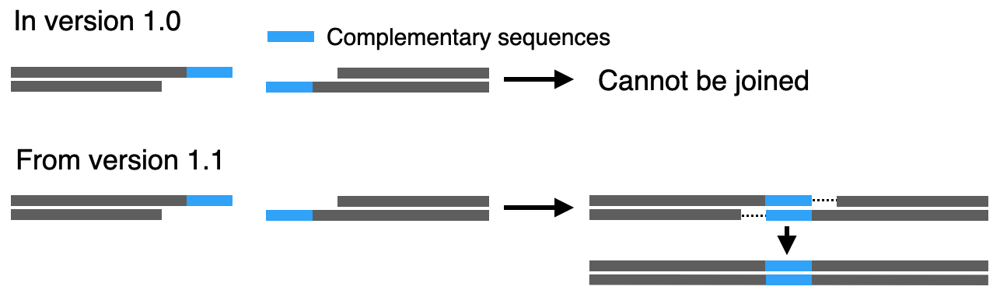

# Changelog
## version 1.2.1 
- `autoflip` parameter was added to `joindna` function.

## version 1.2 
- Bug fix
    - Fixed bug in `joindna` where `compatibility="complete"` did not work. 
    - Fixed bug in `visualizemap` where broken features were not displayed properly.
- CLI was added. 
    - A part of QUEEN functions can now be used from command line. Please see [CLI_usage.md](https://github.com/yachielab/QUEEN/blob/develop/ver1.2/CLI_usage.md) 

## version 1.1 
Several new features were added.
- **Each basic function in queen included docstring.**  
I added the docstring for each class, quinable function, and output function. You can refer the information on Jupyter environment as follows.  

```python 
>>>?modifyends() 
Signature:
modifyends(
    dna,
    left='',
    right='',
    add=0,
    add_right=0,
    add_left=0,
    supfeature=False,
    product=None,
    process_name=None,
    process_description=None,
    pn=None,
    pd=None,
    quinable=True,
    **kwargs,
)
Docstring:
Modify sequence end structures of `QUEEN_object`.

Modify sequence end structures of `QUEEN_object` according to the specified end 
sequence structure.If the topology is `"circular"` or `"ssdna"`, it won't work.

Notes
-----
Sticky ends can be generated by trimming nucleotides where their end structures 
are given by top and bottom strand strings with `"*"` and `"-"` separated by `"/"`, 
respectively. The letters `"-"` indicate nucleotide letters to be trimmed, and the 
letters `"*"` indicate ones to remain.  

Parameters
----------
dna : QUEEN.qobj.QUEEN object
left : str ("str" or "str/str"),  default: None
    Left sequence end structure of `QUEEN_object`. Please refer to the "Notes" for the 
    specifiction.
right : str ("str" or "str/str"),  default: None
    Right sequence end structure of `QUEEN_object`. Please refer to the "Notes" for the 
    specifiction.
supfeature : list of dict
    For detailes, see `QUEEN.queen.qfunction.__doc__`.
product : str
    For detailes, see `QUEEN.queen.qfunction.__doc__`.
process_name : str
    For detailes, see `QUEEN.queen.qfunction.__doc__`.
process_description : str
    For detailes, see `QUEEN.queen.qfunction.__doc__`.
process_id : str 
    For detailes, see `QUEEN.queen.qfunction.__doc__`.
quinable : bool
    For detailes, see `QUEEN.queen.qfunction.__doc__`.

Returns
-------
QUEEN.qobj.QUEEN objecct
```

- **QUEEN object formally supported ssDNA.**  
QUEEN class object now supported a ssDNA structure. By specifying `ssdna=True` when creating a QUEEN object, ssdna object can be generated.
Two ssdna QUEEN objects can be annealed by `joindna` function, producing a dsDNA QUEEN object. For details, see the following example.

```python 
>>> gRNA_top    = QUEEN(seq="CACCGACCATTGTTCAATATCGTCC", ssdna=True)
>>> gRNA_bottom = QUEEN(seq="AAACGGACGATATTGAACAATGGTC", ssdna=True)
>>> gRNA        = joindna(gRNA_top, gRNA_bottom)
>>> gRNA.printsequence(display=True)
5' CACCGACCATTGTTCAATATCGTCC---- 3'
3' ----CTGGTAACAAGTTATAGCAGGCAAA 5'
```

- **`supfeature=dict` parameter was added for the basic quinable functions.**  
The `supfeature` paramter was added for the basic quinable functions (`QUEEN()`, `cutdna()`, `cropdna()`, `joindna()`, `modifyends()`, and `flipdna`). The paramter value is a `dict` object consisting of key-value pairs of the attributes in a DNAfeature object.   
By specifying the `supfeature` value, the DNAfeature objects generated based on the value would be added in the `.dnafeatures` of a newly generated QUEEN object.   
The following attributes have default values, so if they are not specified, the default values will be used.
	- `feature_id`: `str`, (default: Random unique ID which is not used in `.dnafeatures` of the QUEEN object) 
	- `feature_type`: `str` (default: `"misc_feature"`) 
	- `start`: `int` (default: 0) 
	- `end`: `int` (default: length of the `QUEEN_object` sequence)
	- `strand`: `int` (-1, 0 or 1, default: 1)
Please see the following example code as example usage of `supfeature` parameter.

```python
>>> gRNA_top    = QUEEN(seq="CACCGACCATTGTTCAATATCGTCC", ssdna=True)
>>> gRNA_bottom = QUEEN(seq="AAACGGACGATATTGAACAATGGTC", ssdna=True)
>>> gRNA        = joindna(gRNA_top, gRNA_bottom, supfeature={"feature_id":"gRNA-1", "feature_type":"gRNA", "qualifier:label":"gRNA"})
>>> gRNA.printfeature()
feature_id  feature_type  qualifier:label  start  end  strand  
gRNA-1      gRNA          gRNA             0      29   +    
```

- **`quinable=bool` parameter was added for the quinable functions.**  
If the parameter value is `False`, the operational process by the quinable function will not be recorded into the building history of the QUEEN object.

- **`comatibility=str ("partial" or "complete")` and `homology_length=int` parameters were added for `joindna` function.**  
Until version 1, QUEEN objects could not be joined by 'joindna' unless the entire connecting sticky end sequences were complementary, but since version 1.1, QUEEN objects can be joined together as long as the subsequences in sticky ends are complementary (see the following figure). With this change, the parameters `compatibility` and `homology_length` have been added. If you reproduce the operation in version 1.0, the `compatibility` value should be specified as `complete`. For details, please see `QUEEN.qfunction.joindna.__docstring__` or the description of `joindna` in `README.md`.  
Additionally, as mentioned above, ssdna QUEEN objects can now be joined using `joindna`. However dsDNA QUEEN objects and ssDNA QUEEN objects cannot be joined. 



- **`unique=bool` parameter was added to `searchsequence`.**
If the value is `True` and multiple (more than a single) sequence region are detected in the search, `searchsequence` will raise error. 

- **`visualizemap` supported patchworklib.**
If you have installed [patchworklib](https://github.com/ponnhide/patchworklib), output figures by `visualizemap` function can be aligned with `/` and `|` operators.   

**The example QUEEN script using new features in ver1.1 is available from "demo/ver1.1/new\_features.md" and [Google colab](https://colab.research.google.com/drive/1Y4uPZj0pmdznkoO0iv5Av0Z15pG4fN7z?usp=sharing)** 

